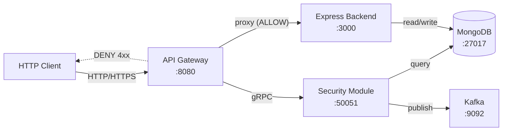
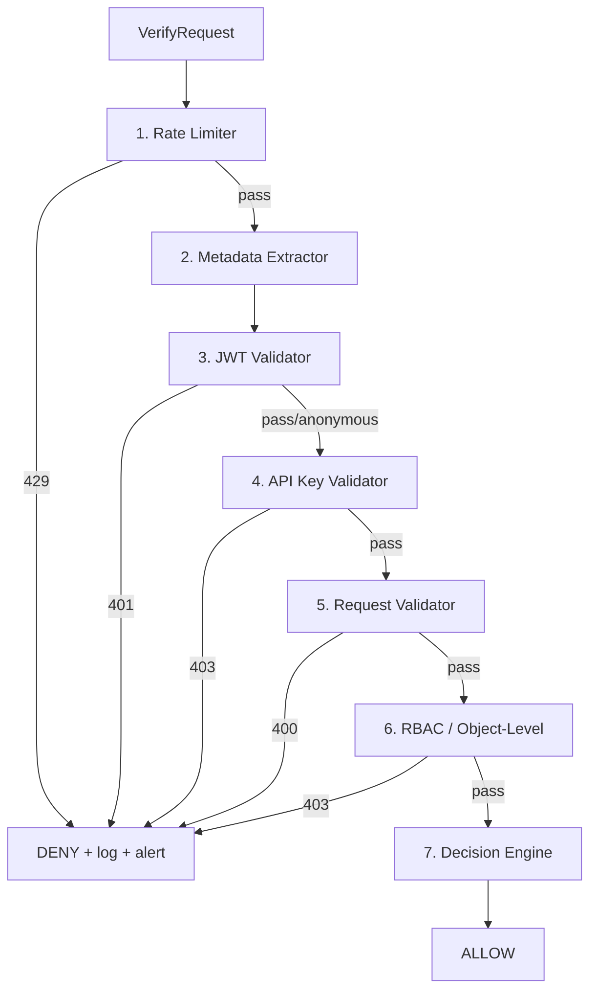

# CyberShield MVP -- API Gateway + Security Module

## Current State Analysis

The repo already has a partially-built Go gRPC security service:

**EXISTS (will enhance):**

- [proto/security.proto](proto/security.proto) -- Minimal: only `path`, `method`, `client_ip` in request; only `verdict`, `reason` in response. Missing JWT/API key/request_id/headers fields.
- [internal/service/security.go](internal/service/security.go) -- Orchestrates validation + RBAC, logs to Mongo, publishes to Kafka. No pipeline pattern.
- [internal/service/rbac.go](internal/service/rbac.go) -- Basic public/user/admin roles + object-level check on `/users/:id`.
- [internal/service/validator.go](internal/service/validator.go) -- Validates path/method/IP only.
- [internal/interceptor/ratelimit.go](internal/interceptor/ratelimit.go) -- Token bucket per IP as gRPC interceptor.
- [internal/interceptor/metadata.go](internal/interceptor/metadata.go) -- Extracts x-client-ip, x-user-id, x-roles from gRPC metadata.
- [internal/store/mongo.go](internal/store/mongo.go) -- Saves basic log entries to `security_logs`.
- [pkg/kafka/producer.go](pkg/kafka/producer.go) -- Publishes to `security-alerts` topic.
- [cmd/security-service/main.go](cmd/security-service/main.go) -- Working gRPC server.

**STUB (needs full implementation):**

- [cmd/gateway/main.go](cmd/gateway/main.go) -- Only prints "Gateway Starting..."

**MISSING (needs creation):**

- JWT validation, API key validation, decision engine, injection detection
- HTTP gateway with reverse proxy
- Docker Compose, Dockerfiles, .env.example, Makefile
- Tests (unit + integration)
- Documentation (architecture.md, api-flow.md)

---

## Architecture




**Request flow inside Security Module `Verify()`:**




---

## Project Structure (Final)

Keeps Go-idiomatic `cmd/` + `internal/` + `pkg/` layout (the user's `apps/` suggestion is adapted to Go conventions):

```
api-protection-service/
  cmd/
    gateway/main.go              # HTTP server + gRPC client + reverse proxy
    security-service/main.go     # gRPC server (enhanced)
    test-client/main.go          # (existing)
  internal/
    gateway/
      proxy.go                   # Reverse proxy to Express
      config.go                  # Gateway config from env
    middleware/
      requestid.go               # X-Request-Id generation
      logging.go                 # Structured request/response logging
      timeout.go                 # Context timeout
      recovery.go                # Panic recovery
    pipeline/
      context.go                 # SecurityContext shared across steps
      pipeline.go                # Orchestrator: runs steps in order
      ratelimiter.go             # Step 1: token bucket per IP
      metadata.go                # Step 2: extract/sanitize headers
      jwt.go                     # Step 3: JWT validation
      apikey.go                  # Step 4: API key lookup in Mongo
      requestvalidator.go        # Step 5: path/method/headers/payload
      rbac.go                    # Step 6: role + object-level checks
      decision.go                # Step 7: final verdict + status code
    handler/grpc.go              # (existing, adapted)
    service/security.go          # (refactored: delegates to pipeline)
    store/
      mongo.go                   # (enhanced: more fields in logs)
      apikeys.go                 # NEW: api_keys collection CRUD
      policies.go                # NEW: policies collection
    interceptor/                 # (simplified: just request-id injection)
    pkg/
      crypto/argon2.go           # (existing)
      kafka/producer.go          # (enhanced: more fields in alerts)
      sanitize/sanitize.go       # (existing)
  proto/
    security.proto               # (expanded messages)
    genProto/                    # (regenerated)
  infra/
    docker-compose.yml
    mongo-init/init.js           # Seed api_keys, policies, indexes
    Dockerfile.gateway
    Dockerfile.security
  backend/
    README.md                    # Integration notes for the Express app
  docs/
    architecture.md
    api-flow.md
  tests/
    integration_test.go          # End-to-end ALLOW/DENY/429/401 tests
  .env.example
  Makefile
  README.md
```

---

## Implementation Details

### Phase 1: Proto Expansion + Pipeline Foundation

**[proto/security.proto](proto/security.proto)** -- Expand messages:

```protobuf
message VerifyRequest {
  string path = 1;
  string method = 2;
  string client_ip = 3;
  map<string, string> headers = 4;
  string user_id = 5;
  repeated string roles = 6;
  string api_key = 7;
  string request_id = 8;
  bytes body = 9;
}

message VerifyResponse {
  Verdict verdict = 1;
  string reason = 2;
  int32 http_status = 3;
  string user_id = 4;
  repeated string roles = 5;
  string correlation_id = 6;
}
```

`**internal/pipeline/**` -- New pipeline pattern:

```go
type Step interface {
    Name() string
    Execute(ctx context.Context, sc *SecurityContext) error
}

type SecurityContext struct {
    Request     *pb.VerifyRequest
    Response    *pb.VerifyResponse
    UserID      string
    Roles       []string
    APIKeyID    string
    Claims      jwt.MapClaims
    Denied      bool
}

type Pipeline struct { steps []Step }
func (p *Pipeline) Run(ctx context.Context, sc *SecurityContext) {
    for _, step := range p.steps {
        if sc.Denied { break }
        step.Execute(ctx, sc)
    }
}
```

### Phase 2: Security Pipeline Steps

Each step in `internal/pipeline/`:


| Step              | File                  | Key Logic                                                                                                                                                                                     |
| ----------------- | --------------------- | --------------------------------------------------------------------------------------------------------------------------------------------------------------------------------------------- |
| Rate Limiter      | `ratelimiter.go`      | Token bucket per IP using `sync.Map` + `x/time/rate`. Ignores spoofed `X-Forwarded-For` unless trusted proxy.                                                                                 |
| Metadata          | `metadata.go`         | Extract + sanitize `x-user-id`, `x-roles`, `x-client-ip` from headers map. Uses existing `pkg/sanitize`.                                                                                      |
| JWT Validator     | `jwt.go`              | Parse Bearer token with `golang-jwt/jwt/v5`. Reject `alg:none`. Validate exp/iat/iss. Extract sub (user_id) and roles claim. Configurable via `JWT_SECRET` env.                               |
| API Key Validator | `apikey.go`           | Lookup `x-api-key` hash in MongoDB `api_keys` collection. Check `status=active` and expiry. Uses `internal/store/apikeys.go`.                                                                 |
| Request Validator | `requestvalidator.go` | Validate path/method/IP (existing). Add: reject NoSQL injection in body (`{"$ne":...}`), reject duplicate query params, reject hidden endpoints for non-admin, basic payload field whitelist. |
| RBAC              | `rbac.go`             | Enhanced from existing. Add: `/api/v1/accounts/{id}/transactions` owner check (BOLA), DELETE requires admin (BFLA), public/user/admin/owner route matrix.                                     |
| Decision Engine   | `decision.go`         | If no step denied: ALLOW. Map deny reasons to HTTP status codes (429 for rate limit, 401 for JWT, 403 for RBAC, 400 for validation). Attach correlation_id.                                   |


**New dependency:** `github.com/golang-jwt/jwt/v5`

### Phase 3: API Gateway

**[cmd/gateway/main.go](cmd/gateway/main.go)** -- Full HTTP server:

- Listen on `:8080` (configurable via `GATEWAY_PORT`)
- Establish gRPC connection to security service (`SECURITY_SERVICE_ADDR`, default `localhost:50051`)
- For every incoming request:
  1. Run middleware chain (request ID, logging, timeout, recovery)
  2. Extract `Authorization: Bearer <token>`, `X-Api-Key`, client IP
  3. Build `pb.VerifyRequest` with path, method, headers, body, etc.
  4. Call `SecurityService.Verify()` via gRPC
  5. If `ALLOW`: use `httputil.ReverseProxy` to forward to Express (`BACKEND_URL`, default `http://localhost:3000`)
  6. If `DENY`: return JSON error with `http_status` from response
- Health: `GET /healthz` -- returns 200
- Readiness: `GET /readyz` -- checks gRPC connection + returns 200

`**internal/gateway/proxy.go`** -- Reverse proxy configuration using `httputil.NewSingleHostReverseProxy` with custom director and error handler.

`**internal/gateway/config.go`** -- All config from env vars with defaults.

`**internal/middleware/**` -- Standard HTTP middleware:

- `requestid.go`: Generate UUID, set `X-Request-Id` header
- `logging.go`: Log method, path, status, duration
- `timeout.go`: `context.WithTimeout` per request (default 30s)
- `recovery.go`: Catch panics, return 500

### Phase 4: MongoDB Enhancements

`**internal/store/apikeys.go**` -- New:

```go
type APIKey struct {
    ID        string    `bson:"_id"`
    KeyHash   string    `bson:"key_hash"`
    Name      string    `bson:"name"`
    Status    string    `bson:"status"` // active, inactive, revoked
    OwnerID   string    `bson:"owner_id"`
    CreatedAt time.Time `bson:"created_at"`
    ExpiresAt time.Time `bson:"expires_at"`
}
func (s *MongoStore) ValidateAPIKey(ctx, keyHash) (*APIKey, error)
```

`**internal/store/policies.go**` -- New: route policies collection for configurable RBAC rules.

**Enhanced `security_logs`** -- Add `request_id`, `user_id`, `roles`, `api_key_id`, `http_status` fields.

`**infra/mongo-init/init.js**` -- Create indexes, seed sample api_keys, seed default policies.

### Phase 5: Kafka Enhancements

**[pkg/kafka/producer.go](pkg/kafka/producer.go)** -- Expand `AlertRecord`:

```go
type AlertRecord struct {
    Timestamp time.Time `json:"timestamp"`
    RequestID string    `json:"request_id"`
    Path      string    `json:"path"`
    Method    string    `json:"method"`
    ClientIP  string    `json:"client_ip"`
    Decision  string    `json:"decision"`
    Reason    string    `json:"reason"`
    UserID    string    `json:"user_id"`
    HTTPStatus int      `json:"http_status"`
}
```

### Phase 6: Docker + Infrastructure

`**infra/docker-compose.yml`:**

- `gateway` -- builds from `Dockerfile.gateway`, port 8080
- `security-service` -- builds from `Dockerfile.security`, port 50051
- `mongodb` -- `mongo:7`, port 27017, with init script volume
- `zookeeper` -- `confluentinc/cp-zookeeper:7.6.0`
- `kafka` -- `confluentinc/cp-kafka:7.6.0`, port 9092, creates `security-alerts` topic
- `backend` (optional) -- commented-out service pointing to Express app

`**infra/Dockerfile.gateway`** + `**infra/Dockerfile.security`** -- Multi-stage Go builds (builder + alpine).

`**Makefile**` -- Targets: `proto`, `build`, `run`, `docker-up`, `docker-down`, `test`, `test-integration`.

`**.env.example`:**

```
GATEWAY_PORT=8080
SECURITY_SERVICE_ADDR=security-service:50051
BACKEND_URL=http://backend:3000
MONGODB_URI=mongodb://mongodb:27017
MONGODB_DB=api_protection
KAFKA_BROKERS=kafka:9092
JWT_SECRET=your-secret-key-change-in-production
RATE_LIMIT_RPS=10
RATE_LIMIT_BURST=20
```

### Phase 7: Tests

**Unit tests** (alongside source files):

- `internal/pipeline/ratelimiter_test.go` -- burst, exceed, reset
- `internal/pipeline/jwt_test.go` -- valid token, expired, alg=none, missing, malformed
- `internal/pipeline/apikey_test.go` -- valid, inactive, expired, missing
- `internal/pipeline/requestvalidator_test.go` -- NoSQL injection body, duplicate params, hidden endpoints
- `internal/pipeline/rbac_test.go` -- BOLA (other user's account), BFLA (user DELETE), public, admin, owner-only
- `internal/pipeline/pipeline_test.go` -- full pipeline ALLOW/DENY flow
- `internal/middleware/requestid_test.go`

**Integration tests** (`tests/integration_test.go`):

- Spin up security-service gRPC, test against it
- ALLOW flow: valid JWT + authorized path -> ALLOW
- DENY flow: no auth + protected path -> DENY 403
- Rate limit: burst requests -> 429
- Invalid JWT: expired/alg=none -> 401
- Invalid API key -> 403
- BOLA: user accessing another user's resource -> 403

### Phase 8: Documentation

`**README.md`** -- Full rewrite: project overview, structure, setup, env config, `make docker-up`, sample curl commands for ALLOW and DENY flows, testing instructions.

`**docs/architecture.md`** -- Component diagram, request flow, security pipeline description, technology choices.

`**docs/api-flow.md**` -- Step-by-step request lifecycle with examples: ALLOW (valid JWT + authorized), DENY (rate limit), DENY (BOLA), DENY (invalid JWT).

`**backend/README.md**` -- Integration notes explaining how to connect an existing Express backend as upstream.

---

## Key Design Decisions

1. **Pipeline pattern over interceptor chain** -- All 7 security steps run inside `Verify()` as an explicit pipeline, not as scattered gRPC interceptors. This ensures every deny flows through the same logging/alerting path and the pipeline order is visible in one place.
2. **Go-idiomatic structure** -- Keep `cmd/` + `internal/` + `pkg/` convention instead of `apps/`. Add `infra/`, `docs/`, `backend/` directories for the non-Go artifacts.
3. **Gateway uses stdlib** -- `net/http` + `httputil.ReverseProxy`. No framework. Keeps dependencies minimal and the code transparent.
4. **JWT with configurable algorithm** -- Default HS256 with `JWT_SECRET` env var. Structure supports RS256 with public key file. Always reject `alg:none`.
5. **API keys hashed with SHA-256** -- Keys stored as hashes in MongoDB, never in plaintext. Lookup by hash.
6. **Rate limiter ignores X-Forwarded-For by default** -- Only trusts client IP from the TCP connection unless `TRUST_PROXY=true` is set. Prevents header spoofing bypass.
7. **Security logs always written** -- Both ALLOW and DENY decisions are logged to MongoDB. Kafka alerts only fire on DENY/suspicious.

---

## Attack Coverage Matrix


| Attack                | Pipeline Step            | Detection                                                        |
| --------------------- | ------------------------ | ---------------------------------------------------------------- |
| BOLA / ID Enumeration | RBAC                     | Owner check on `/accounts/{id}`, `/users/{id}`                   |
| NoSQL Injection       | Request Validator        | Reject `$ne`, `$gt`, `$regex` patterns in body                   |
| Mass Assignment       | Request Validator        | (Backend responsibility -- gateway logs suspicious extra fields) |
| Rate Limit Bypass     | Rate Limiter             | Ignore spoofed X-Forwarded-For; per-IP bucket                    |
| JWT alg=none          | JWT Validator            | Reject tokens with alg=none or empty signature                   |
| BFLA                  | RBAC                     | DELETE/PUT on admin routes requires admin role                   |
| Parameter Pollution   | Request Validator        | Flag duplicate query parameters                                  |
| Hidden Endpoints      | RBAC + Request Validator | Block /admin, /internal, /debug for non-admin                    |
| File Upload           | Request Validator        | Content-Type + size limit checks                                 |
| Business Logic        | N/A                      | Backend responsibility (negative qty, price override)            |


