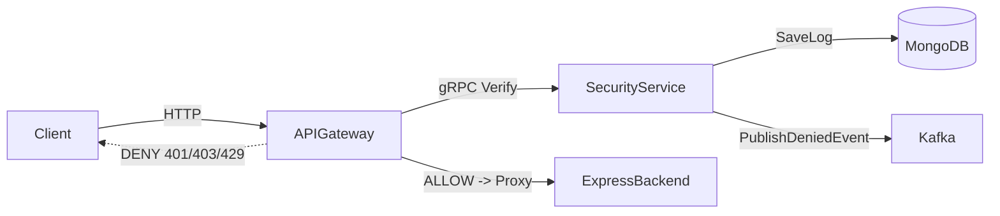
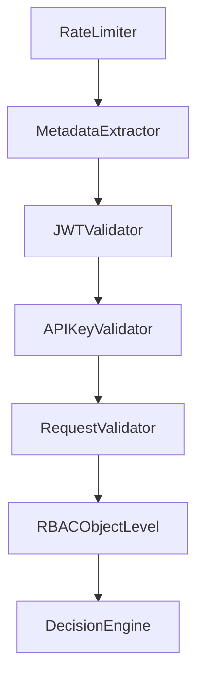

# Architecture

## Components

- API Gateway (`cmd/gateway`) - external HTTP boundary, request metadata extraction, gRPC authorization check, reverse proxy to backend.
- Security Module (`cmd/security-service`) - gRPC `SecurityService.Verify` implementing the 7-stage pipeline.
- Existing Express backend - business service reused as upstream via `BACKEND_URL`.
- MongoDB - shared persistence for `security_logs`, `api_keys`, `policies`.
- Kafka - asynchronous security alerts topic `security-alerts`.

## High-Level Flow

## Security Pipeline

Order is strict and implemented in `internal/pipeline/builder.go`.

## Data Model

### `security_logs`
- `timestamp`
- `request_id`
- `correlation_id`
- `path`
- `method`
- `client_ip`
- `decision`
- `reason`
- `http_status`
- `user_id`
- `roles`
- `api_key_id`

### `api_keys`
- `_id`
- `key_hash` (SHA-256 of plaintext key)
- `status` (`active`, `inactive`, `revoked`)
- `owner_id`
- `expires_at`

### `policies`
- `_id`
- `path`
- `method`
- `role`

## Practical MVP Choices

- HS256 JWT validation enabled by default through `JWT_SECRET`.
- API key required for protected routes (`REQUIRE_API_KEY=true`).
- Rate limit identity uses IP + user + user-agent to reduce simple bypass.
- Express backend integration is upstream-only; no business endpoint reimplementation.
